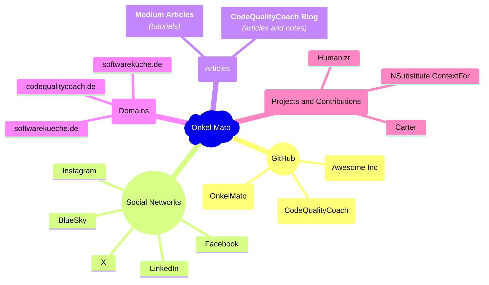

Good morning

```mermaid
mindmap
  root)Onkel Mato(
    github((GitHub))
      onkelmatogitgub(OnkelMato)
      ccc(CodeQualityCoach)
      awesome(Awesome Inc)
    social((Social Networks))
      LinkedIn
      Facebook
      Instagram
      BlueSky
      X
    articles(Articles)
      blog["**CodeQualityCoach Blog**
_(articles and notes)_"]
      medium["**Medium Articles**
_(tutorials)_"]
    domains(Domains)
      codequalitycoach.de
      softwarekueche.de
      softwareküche.de
    projects(Projects and Contributions)
      Carter
      Humanizr
      NSubstitute.ContextFor

```

